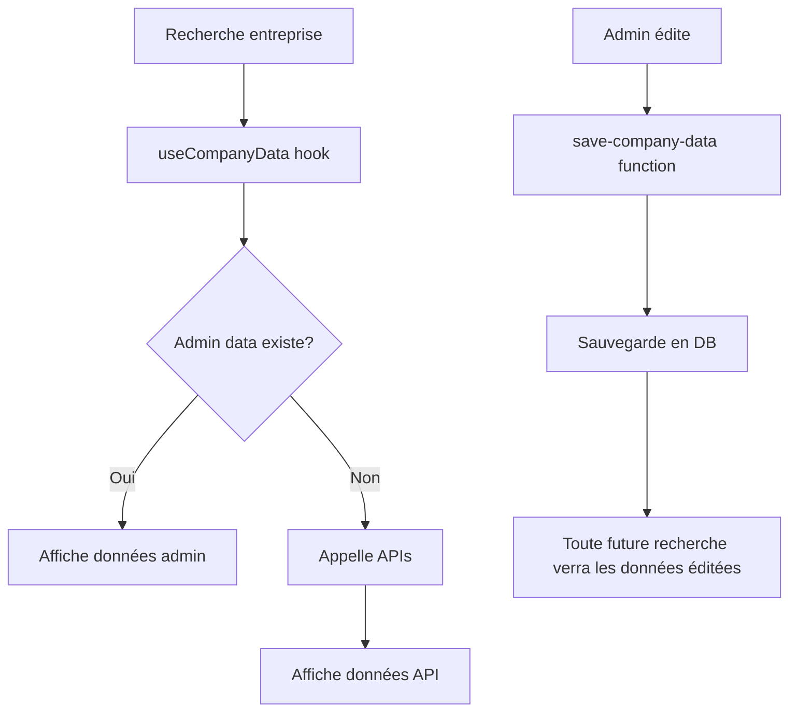

# Système d'Administration - Guide

## Vue d'ensemble

Le système d'administration permet aux admins d'éditer les pages de résultats d'entreprises via une interface WYSIWYG. Les données éditées sont sauvegardées et prioritaires sur les données API pour tous les utilisateurs.

## Architecture

### 1. Authentification & Rôles

**Base de données** :
- Table `user_roles` avec enum `app_role` (admin, moderator, user)
- Fonction sécurisée `is_admin()` pour vérifier les droits
- RLS policies basées sur les rôles

**Frontend** :
- `AuthContext` : Gestion de la session et vérification du rôle admin
- `ProtectedRoute` : Composant pour protéger les routes admin
- Page `/auth` : Connexion/Inscription

### 2. Interface WYSIWYG

**Routes Admin** :
- `/admin/dashboard` : Vue d'ensemble
- `/admin/editor` : Éditeur WYSIWYG pour rechercher et éditer des entreprises
- `/admin/companies` : Liste des entreprises
- `/admin/users` : Gestion des utilisateurs
- `/admin/analytics` : Statistiques

**Composants clés** :
- `CompanyWYSIWYGEditor` : Interface d'édition en temps réel
- `ResultPage` : Composant partagé entre vue user et admin
- `EditableField` / `EditableSelect` : Champs éditables en ligne

### 3. Flux de données



**Priorité des données** :
1. Données éditées par admin (table `admin_companies`)
2. Données des APIs (Sirene, Pappers, Infogreffe, etc.)

## Utilisation

### 1. Créer un compte admin

**SQL à exécuter** :
```sql
-- Insérer un rôle admin pour un utilisateur
INSERT INTO public.user_roles (user_id, role)
VALUES ('USER_UUID_FROM_AUTH', 'admin');
```

### 2. Se connecter

1. Aller sur `/auth`
2. Se connecter avec l'email admin
3. Accéder à `/admin`

### 3. Éditer une entreprise

1. Aller sur `/admin/editor`
2. Rechercher l'entreprise par SIREN/SIRET
3. Éditer les champs directement en cliquant dessus
4. Sauvegarder les modifications
5. Les données éditées seront visibles pour tous les utilisateurs

## Sécurité

### Protection des routes
- Toutes les routes `/admin/*` sont protégées par `ProtectedRoute`
- Vérification du rôle admin côté serveur via RLS policies
- Session gérée par Supabase avec auto-refresh

### RLS Policies
- `admin_companies` : Seuls les admins peuvent modifier
- `admin_edit_logs` : Logs de toutes les modifications
- `user_roles` : Gérée par les admins uniquement

### Validation
- Input validation avec Zod
- Vérification des rôles par fonction SECURITY DEFINER
- Prévention des attaques par escalade de privilèges

## Synchronisation User/Admin

Le système utilise une architecture à 3 piliers (voir `docs/architecture/result-page.md`) :

1. **Source unique de vérité** : `ResultPage.tsx`
2. **Configuration centralisée** : `resultTabs.ts`
3. **Mapping unifié** : `buildCompanyDisplay.ts`

Toute modification de l'UI des résultats se fait dans ces fichiers partagés, garantissant la cohérence entre les vues user et admin.

## Configuration

### Variables d'environnement
Aucune configuration supplémentaire nécessaire - le système utilise la connexion Supabase existante.

### Permissions
Pour donner les droits admin à un utilisateur, utilisez le SQL ci-dessus après sa création de compte.

## Logs et Monitoring

- Table `admin_edit_logs` : Historique des modifications
- Table `admin_search_history` : Historique des recherches
- Edge function logs disponibles dans Supabase

## Support

Pour toute question :
1. Vérifier les logs d'erreur dans la console
2. Consulter les logs Supabase
3. Vérifier les RLS policies si problème d'accès aux données
